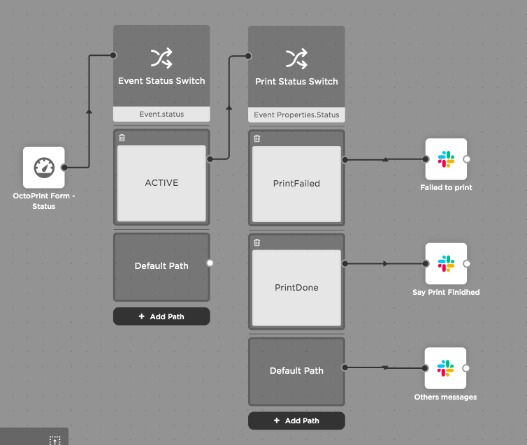

# OctoPrint-Xmatters-integration

This plugin helps to send notifications by using [xMatters](https://xmatters.com) integration.

## Setup

Install via the bundled [Plugin Manager](https://github.com/foosel/OctoPrint/wiki/Plugin:-Plugin-Manager)

### Manually using this URL:

    https://github.com/svv2014/OctoPrint-Xmatters-integration/archive/master.zip

### Using `pip`

    pip install https://github.com/svv2014/OctoPrint-Xmatters-integration/archive/master.zip

### After install
    
Do a full restatart of OctoPrint, there is an issue that is listed in TODO section.

## xMatter integration setup 

* Open your xMatters page
* go to page: Developer > Communication Plans
* Import zip file from `xMatters/OctoPrintIntegration.zip` 
    * this will create communication plan for integration
* On communication plan press `Edit` and choose `Integration Builder`
* You should see one configured `Inbound integration`  
    * Note if `Inbound integrations` configuration was not imported you may need to create once with `authentication method` equals to `API key`. 
* Open this configuration and at the bottom you will find all needed credentials

## Configuration

* Take `API Key`, `Secret`, `Integration URL` from xMatters integration and set it in plugin configuration
    * Note: for `recipients` field use comma separated user ids. To find user id in xMatters you should open "users" tab, find your user and you will see it in column "User Id".
* Choose events you interested in and enjoy.

## Slack integration by using Flow Designer 
If you just updated to version `0.1.8` you need to update your communication plan. 

Follow these steps: 
* go to page: Developer > Communication Plans
* Import zip file from `xMatters/OctoPrintIntegration.zip` 

A few new fields were added that you could benefit from. There were added `Status` and  `FileName`.
Possible statuses: 
* PrintStarted
* PrintDone
* PrintPaused
* PrintResumed
* PrintFailed
* MovieDone

Then you can go to Flow Designer and setup integration with Slack
* Developer > Communication Plans -> OctoPrint Integration -> Edit -> Flows

To have your custom message in the Slack that depends on Print Status you can follow this screenshot:

<kbd>
  
</kbd>

## TODO
* Add test button to check integration with xMatters 
* custom messages
* option to send a photo with notification
